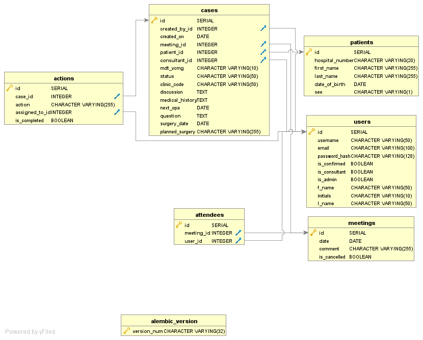

# FFR Urology MDT app design

## Current system

MDTs are organised using an Excel spreadsheet and an MDT proforma Word document created for each case. 
These are on a shared drive, allowing access to each document from trust computers that have Excel and Word installed by default. 
All information is entered in free text, with only human checks for data integrity and completeness.

For brevity, most of the fields shown in Figure 1 are being recorded currently. 
Figure 1 does contain some extra fields for data completeness.  

### Current issues

1. If multiple users open the document, only the first to open it may edit.
2. Required fields may be left blank by the users, leading to incomplete data.
3. Cases can be duplicated by copy and pasting errors, repeating the discussion of cases unnecessarily.
4. The MDT and proforma documents share the same fields, duplicating manual data entry. 
5. Patient demographics are manually inputted, allowing for errors and no synchronisation of updated patient demographics. 
6. Inconsistent marking of case status, with no key for colours leading to ambiguity.
7. Currently no simple way to find all outstanding actions to be completed for a single user.
8. Each case does not have a date linked to it, so filtering by date is done by the physical position within the spreadsheet.
9. No quick method to determine the number of cases per MDT, number to be discussed and number completed. 
10. No efficient audit process

### Requirements

#### 1. Simultaneous  multi-user editing, accessible from any trust computer.
#### 2. Data structure and forms:
  - Required fields for data entry form
  - Relational design with objects/tables for meeting, case, patient, user, actions (see Figure 1 for a complete list of fields and their relations)
  - Proforma and MDT to use the same shared fields
  - Multiple-choice fields where possible (links to other objects/tables, case status and action completed)
  - Date in DD-MMM-YYYY format (e.g. 17-Jan-2017)
  - Form validation for data format and required fields, with informative error messages.
#### 3. Query patient demographics database for required information (not currently possible)
#### 4. User authentication, with no way to view the passwords and ability to reset passwords.
#### 5. Requirements for each section of the application.
  - Meetings (list, create and edit): 
    - Unique dates
	- Ideally use datepicker to enter date
    - Cancel meetings which makes them no longer selectable and any cases are moved to the next available date. 
  - Patients (list, create and edit):
    - Patient first name, last name, unique hospital number, date of birth and sex 
    - First name, last name and date of birth are unique together
    - Age today shown after date of birth
  - Cases (list, create and edit):
    - View cases: all or filter by meeting. If filtered by meeting, can select users who attended MDT. Show summary of case statuses and highlight rows by status
	  - Add new case: view all previous cases for patient in the same page. No discussion or actions can be added when creating a new case.
	  - Patient, consultant (user who has identified as consultant), clinic code and users selected from dropdown. 
	  - Date created on and case created by to be autopopulated, ideally using a datepicker for entering the date
	  - To edit a case during MDT, all proforma, discussion and actions to be viewable on a single page of a 15" monitor.
  - Actions (list, create and edit):
    - Create actions for each case in the Case edit form and assign a user to each action.
    - Complete each action seperately
    - Filter cases by assigned user, showing outstanding and completed actions
  - Superuser/administrator access should allow for deleting of records
#### 6. Maintainable system 
- Externally maintained or developed in flask for maintenance by the Clinical Computing group in Medical Physics
